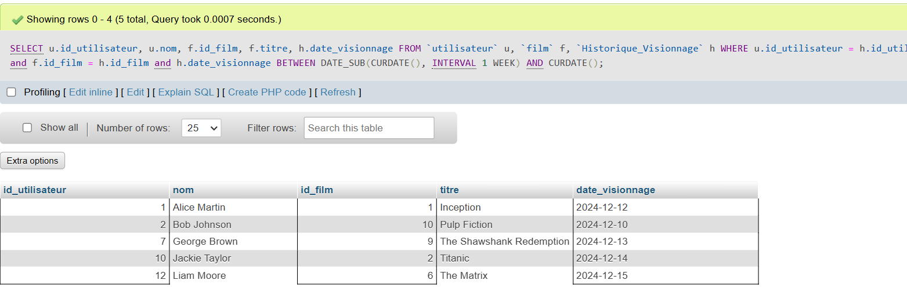

1. Listez tous les utilisateurs inscrits depuis plus d’un an.

2. Affichez les films d’un genre spécifique, triés par année de sortie.

3. Trouvez les utilisateurs ayant un abonnement 'Premium' dont la date de fin est dans
moins d’un mois.

4. Affichez les utilisateurs et les films qu’ils ont visionnés au cours de la dernière semaine.

5. Listez les films qui n’ont pas été visionnés par aucun utilisateur.

6. Trouvez les utilisateurs qui ont regardé plus de 10 films depuis leur inscription.

7. Affichez tous les abonnements, y compris ceux des utilisateurs non enregistrés dans la
table des visionnages.

8. Affichez tous les utilisateurs, même ceux qui n’ont pas d’abonnement.

9. Listez les utilisateurs qui ont regardé le même film plusieurs fois.

10. Trouvez les 3 films les plus regardés au cours des 6 derniers mois.

11. Identifiez les utilisateurs ayant un abonnement actif, mais n’ayant visionné aucun
film.

12. Créez un utilisateur SQL avec un accès en lecture seule sur toutes les tables.

13. Accordez à un administrateur SQL le privilège de modifier les informations des films et
des abonnements.

14. Affichez les films qui durent plus de 2 heures et ont été visionnés par des utilisateurs
ayant un abonnement 'Standard'.

15. Trouvez les utilisateurs ayant regardé un film d’un genre spécifique, mais n’ayant pas
d’abonnement 'Premium'.
